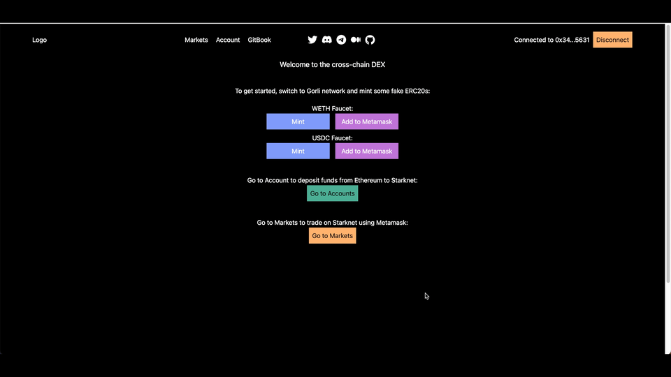

# .github

We have built a native cross-chain DEX on Starknet that allows users from other chains (Ethereum, Polygon, Arbitrum, etc.) to deposit assets and trade using their Metamask. The DEX is a composable liquidity layer (CLOB) without impermanent loss and slippage.

The cross-chain concept is demonstrated through Ethereum's EIP-712. The user can sign a message that specifies an action (ex: place buy limit order, cancel order or withdraw funds). The signed message is then verified and executed on Starknet through a third-party account (currently by us, but this step can be executed by anyone in a trustless manner or through an EIP-4337 paymaster).

Currently, the asset bridging is using the native Starknet L1<>L2 messaging, but future iterations will be leveraging Starknet’s cheap computing cost to achieve the cross-chain asset bridging through storage proof (state proof), which will be faster and more trustless than the existing solution (https://tinyurl.com/4w7cmcmw).
